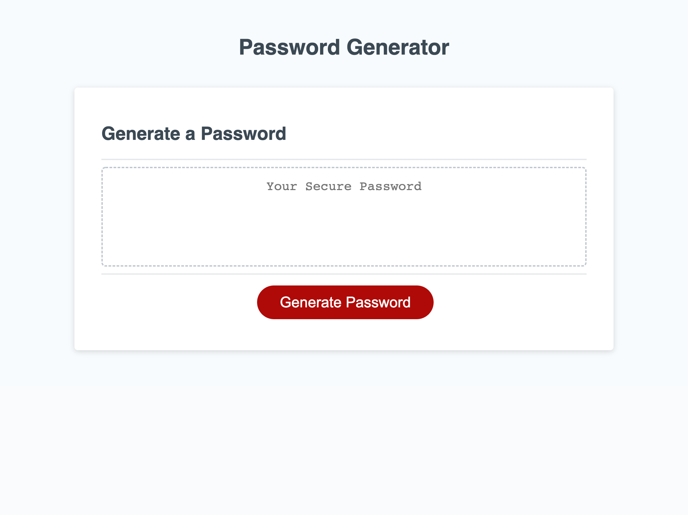

# password-generator-project
03-JavaScript

## Table of Contents
1. [Description](#Description)
2. [Visuals](#visuals)

## Description
This password generator project functions to create a randomly generated password with specific criteria by utilizing JavaScript. When a user clicks the "generate password" button, they are met with several prompts to to answer. These prompts will ask the user how long they would like their password to be and what characters would they like to include. If the user chooses outside of the parameters set, they are met with additional prompts. After all prompts are properly answered, a random password will be generated within the text box.  
[Link to live site](https://brandym98.github.io/password-generator-project/)

## Visuals

